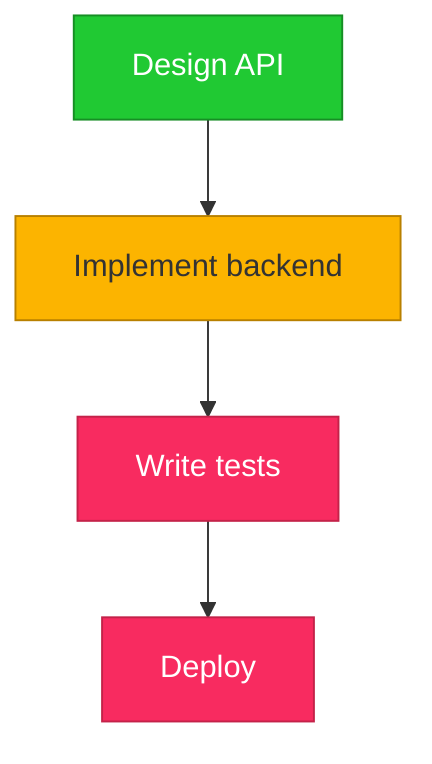

# ari-diagram-gh-todo

Track TODO items with dependencies as color-coded mermaid diagrams, posted as GitHub PR/issue comments.

## Color Scheme (status-based)

| Status | Color | Hex |
|--------|-------|-----|
| Unstarted / Blocked | Red | `#F82B60` |
| In Progress | Yellow | `#FCB400` |
| Done / Complete | Green | `#20C933` |

## Workflow

1. **Gather TODOs** from user — each item needs: name, status (unstarted/in-progress/done), dependencies
2. **Create a temp dir**: `TMPDIR=$(mktemp -d /tmp/todo-diagram-$(date +%s%3N)-XXXXXXX)`
3. **Build mermaid `graph TD`** and write to `$TMPDIR/diagram.mmd`:
   - Each TODO as a node, labeled with task name
   - Dependency arrows (`A --> B` means B depends on A)
   - Status-based classDefs and class assignments:
     ```mermaid
     classDef red fill:#F82B60,stroke:#C42249,color:#fff
     classDef yellow fill:#FCB400,stroke:#B88000,color:#333
     classDef green fill:#20C933,stroke:#168E24,color:#fff
     ```
4. **Bake**: `$HOME/.claude/skills/ari-diagram-mermaid/bin/bake $TMPDIR/diagram.mmd`
5. **Post as a GitHub comment** using `gh`. The comment MUST have this format:
   - An `## <Title>` header
   - A single sentence describing the diagram
   - A horizontal rule (`---`)
   - The mermaid fenced block

   ```bash
   gh issue comment <number> --body "$(cat <<'EOF'
   ## <Title>
   <One-sentence description of the diagram.>

   ---

   ```mermaid
   <diagram source>
   ```
   EOF
   )"
   ```

   Or for PRs, use `gh pr comment` with the same format.
   GitHub natively renders mermaid in comments — no image URL needed.
6. **Also provide** the mermaid.ink URL for embedding elsewhere (Google Docs, Slack, etc.)

## Example

For TODOs:
- "Design API" (done)
- "Implement backend" (in-progress, depends on Design API)
- "Write tests" (unstarted, depends on Implement backend)
- "Deploy" (unstarted, depends on Write tests)

### GitHub comment body:

```markdown
## API Launch Progress
4 tasks tracked — 1 done, 1 in progress, 2 remaining.

---


```
